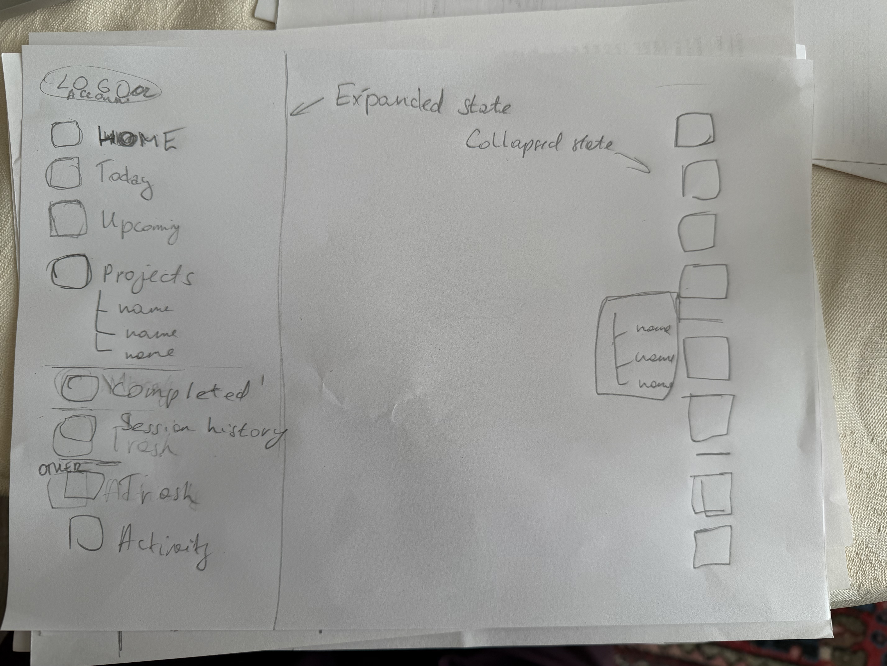
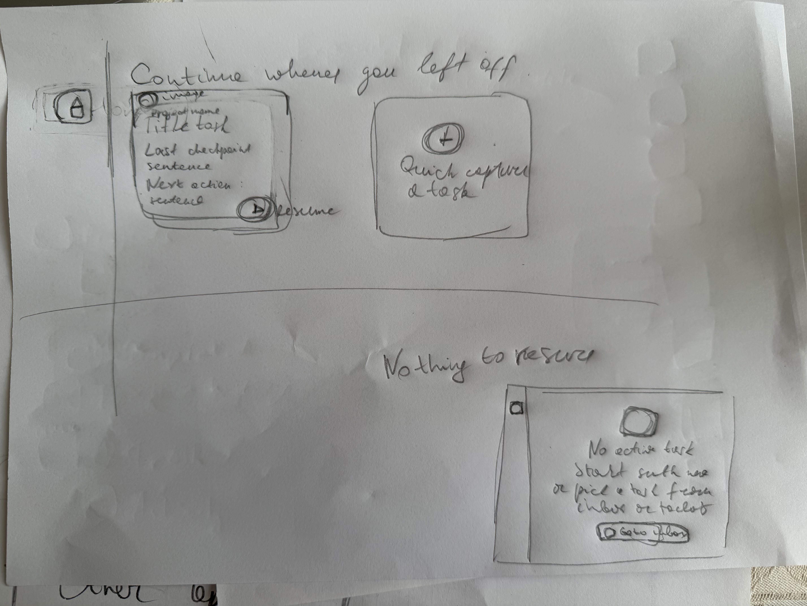
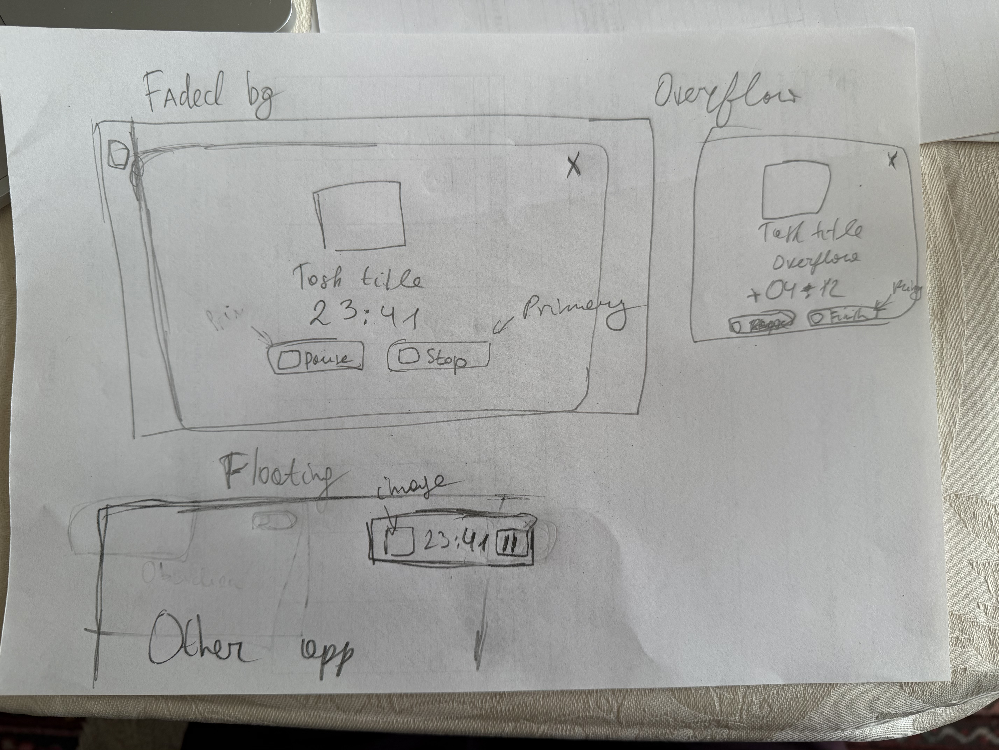
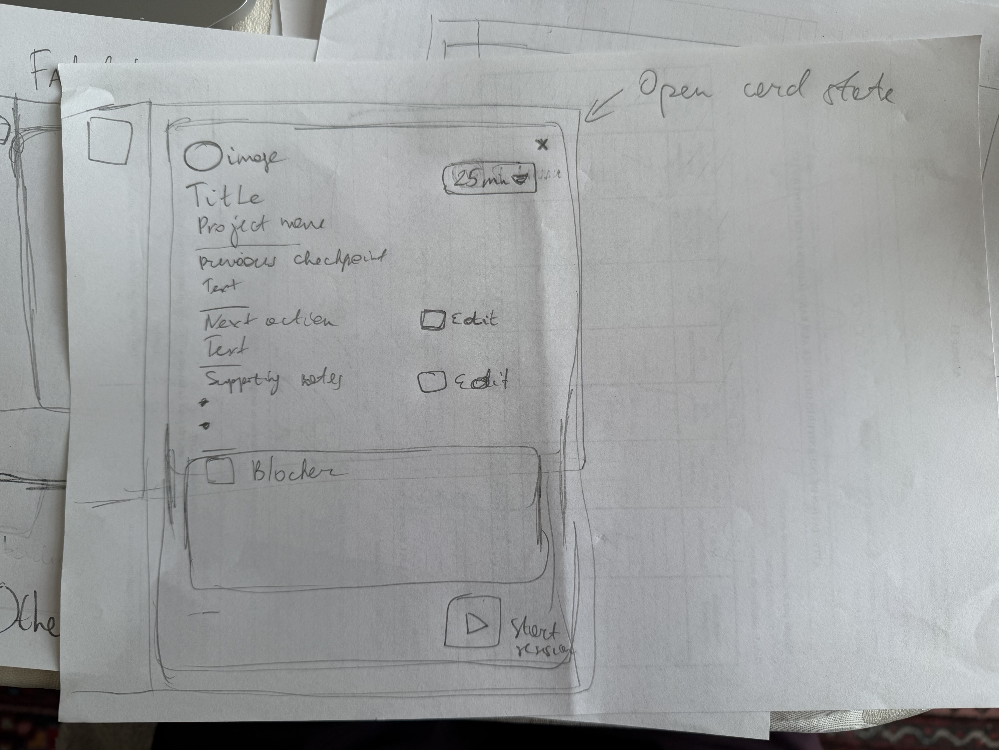
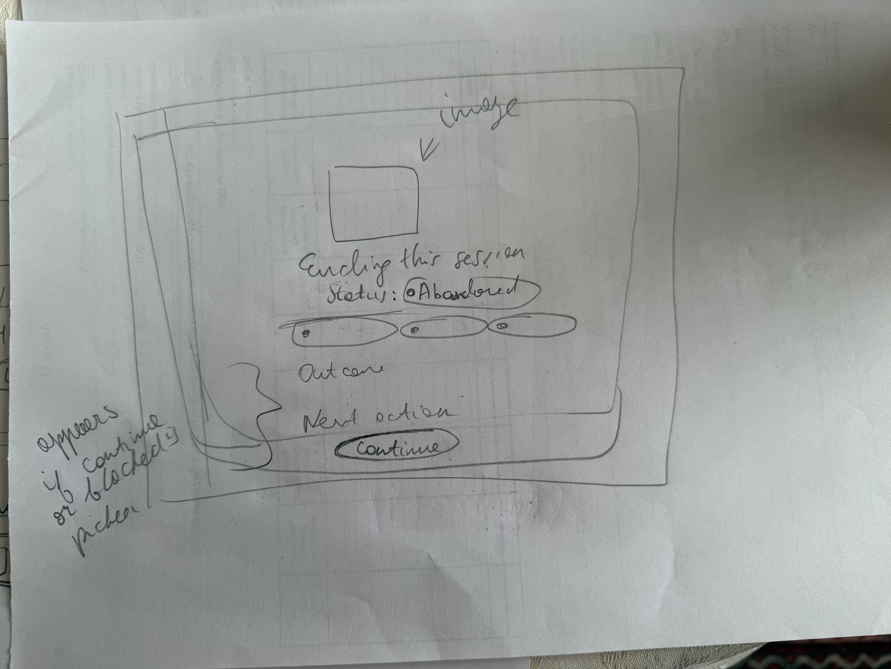
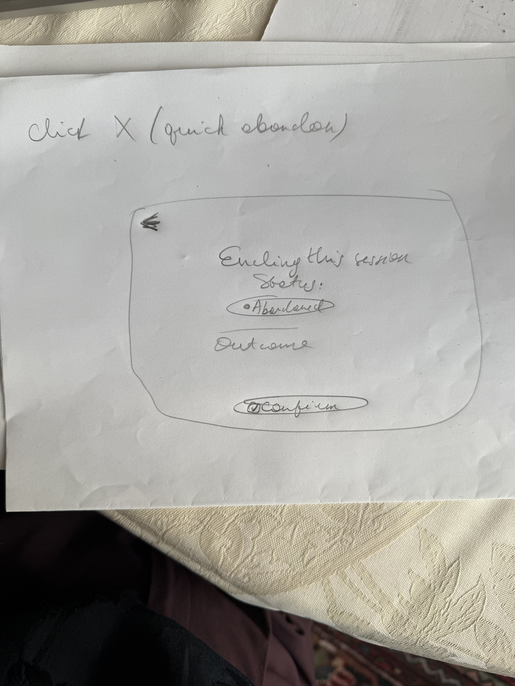
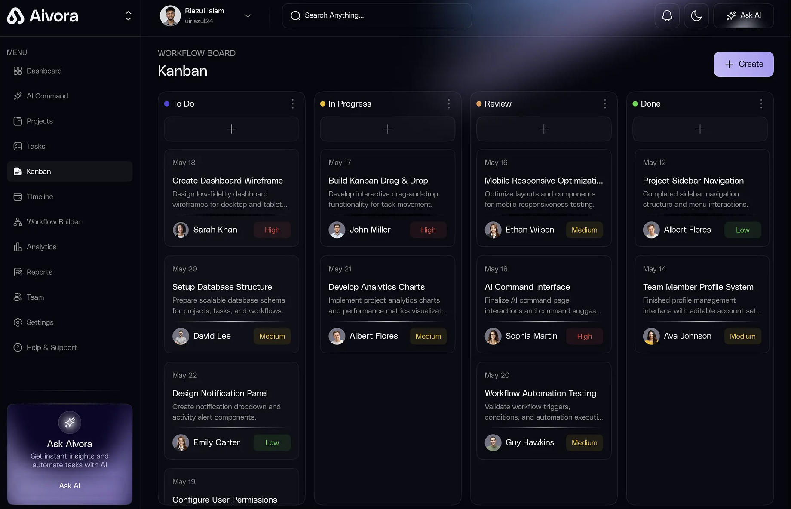

# Obsidian Focus Companion

## 3IXD Dev5 Assignment 1 Report

**Author:** Anastasiia Kovtun  
**Repository:** <https://github.com/anastasiiakovtun/local-productivity-system>

## 1. Product overview

Obsidian Focus Companion is a local-first Electron desktop application that combines task management and adjustable focus sessions. It serves people who already keep durable project knowledge in Obsidian but need a lightweight execution layer for tasks, timing, and resumable work.

The product promise is: **Resume meaningful work without reconstructing your mental state.**

SQLite stores queryable local application state. The selected Obsidian vault receives readable, append-only Markdown records for task and focus events. No account, cloud service, analytics, telemetry, or remote AI is required.

## 2. Research

Research compared three task applications and three focus/time-tracking applications. “Unnecessary” means unnecessary for this MVP, not universally bad. The full evidence, classifications, and source list are preserved in [`docs/research/app-landscape-report.md`](../research/app-landscape-report.md).

### 2.1 Task applications

| Application | Essential findings | Useful later | Unnecessary for this MVP |
|---|---|---|---|
| Todoist | Fast capture, dates, reminders, recurrence, projects, priorities, subtasks [16][17][18] | Duration, deadlines distinct from dates, a small filter set | Team workspaces, billing, large reporting surfaces, AI assistance |
| Things 3 | Today/Upcoming planning, start dates distinct from deadlines, projects/areas, reminders [19][20] | Calendar context, lightweight notes, deep links | Rebuilding rich notes, backlinks, attachments, and graph features already owned by Obsidian |
| TickTick | Task capture, reminders, lists, recurrence, subtasks, task-linked focus timing [2][3][6] | Calendar/time-blocking and estimated-versus-actual review | Habits, achievements, broad templates, collaboration, and general productivity-suite expansion |

### 2.2 Focus and time-tracking applications

| Application | Essential findings | Useful later | Unnecessary for this MVP |
|---|---|---|---|
| Toggl Track | Live timing, manual correction, task/project attribution, simple summaries [21][22][23] | Offline capture, calendar context, export | Billing, rates, profitability, approvals, team administration, exhaustive app/site surveillance |
| Focus To-Do | Task → estimate → timer → break loop; configurable work and break lengths; actual time review [11][15][26] | Optional synchronization and editable records | Habits, Gantt charts, rankings, rich notes, media library |
| Session | Intention before focus, flexible duration, Overflow, minimal history and outcome [27][28] | Blocking, review, shortcuts, automation | Large automation ecosystem, device controls, rich reflection system |

### 2.3 Essential product baseline

The repeated baseline was small: capture a task, decide when it matters, choose one task, run or record focused work, correct mistakes, and review a small amount of history. The product therefore prioritizes task lifecycle operations, task-linked timing, configurable focus/break durations, reviewable sessions, and local Markdown logging.

### 2.4 Custom ideas

1. **Resume Packet:** Before a focus session, show the last outcome, next action, supporting notes, and blocker so work can restart without a manual vault search.
2. **Privacy-preserving handoff history:** Capture explicit task/session transitions and outcomes without monitoring every application, website, or keystroke.

The first idea became a core feature. The second informed the local, append-only Activity and Focus Log model without adding surveillance.

### 2.5 Research sources

Official product/help sources included Todoist Quick Add, recurrence and pricing; Things features and date behavior; TickTick task and focus documentation; Toggl desktop, data structure, reports, Pomodoro and pricing documentation; Focus To-Do product/privacy information; and Session setup/pricing documentation. Recent Reddit and Hacker News discussion was treated only as limited sentiment evidence. Complete uncertainty notes appear in the research record.

- [2] <https://ticktick.com/about/upgrade>
- [3] <https://help.ticktick.com/articles/7055782422935240704>
- [6] <https://help.ticktick.com/articles/7055781966800486400>
- [11] <https://apps.microsoft.com/detail/9n8gpb2tk8gb?gl=US&hl=en-US>
- [15] <https://focustodo.cn/privacy-policy>
- [16] <https://www.todoist.com/help/todoist/features/use-task-quick-add-in-todoist-va4Lhpzz>
- [17] <https://www.todoist.com/help/todoist/features/introduction-to-recurring-dates-YUYVJJAV>
- [18] <https://www.todoist.com/pricing>
- [19] <https://culturedcode.com/things/features>
- [20] <https://culturedcode.com/things/support/articles/2803579>
- [21] <https://support.toggl.com/toggl-track-desktop-app-for-macos>
- [22] <https://support.toggl.com/en-us/article/data-structure-in-toggl-track-14d14io>
- [23] <https://support.toggl.com/en-us/article/summary-report-1emjk2m>
- [24] <https://support.toggl.com/how-to-enable-the-pomodoro-timer>
- [25] <https://toggl.com/track/pricing>
- [26] <https://focustodo.cn/?lang=en_US>
- [27] <https://stayinsession.com/learn/getting-started-with-session-pomodoro-app>
- [28] <https://stayinsession.com/pricing>

## 3. Grill session and PRD

A structured Grill session challenged the initial “to-do + Pomodoro” idea across user value, scope, data ownership, workflow, privacy, platform risk, and architecture. The evidence record is preserved in [`docs/research/grill-session.md`](../research/grill-session.md). It identifies six decision rounds, traces each outcome to `PRD.md`, `CONTEXT.md`, and ADR-0001, and explicitly states that it is a structured reconstruction rather than a verbatim transcript.

### 3.1 Intended user and problem

The representative user is a student/knowledge worker who already uses Obsidian for notes and project work. Existing task and timer tools often preserve the task name and elapsed time but not enough context to explain where work stopped or what should happen next.

### 3.2 Core features

- Create, view, edit, complete, reopen, and delete tasks.
- Persist task and session data locally.
- Start, pause, resume, finish, and cancel focus sessions.
- Link each session to a task.
- Change focus and break durations.
- Take a timed break after a completed session.
- Review completed and abandoned sessions.
- Write task lifecycle and focus-session events to Obsidian Markdown.
- Show a Resume Packet before focus and capture a Checkpoint afterward.

### 3.3 Non-goals

The MVP does not provide accounts, cloud sync, collaboration, mobile clients, recurring tasks, habits, calendar/time-blocking UI, AI summaries, gamification, multiple vaults, or a second rich notes system. Obsidian remains the knowledge system.

### 3.4 Main flow

1. Select an Obsidian vault.
2. Capture a task.
3. Open the task’s Resume Packet.
4. Choose a focus duration and start the session.
5. Pause/resume if needed; continue in Overflow when the minimum commitment ends.
6. Finish and save a Checkpoint with outcome and status.
7. Take or skip a configurable break.
8. Review the session later and resume from the saved context.

### 3.5 Acceptance criteria

The final app supports all assignment-minimum task and timer actions. All required task lifecycle and session events are written by application code. Every durable log entry includes date, time, UTC offset, IANA timezone, event type, status, and relevant task/session data. Tests and a packaged lifecycle run verify local persistence and generated Markdown.

## 4. Technical and design decisions

### 4.1 Framework

The application uses Electron, Vue 3 Composition API, Pinia, Vite, and plain JavaScript. Electron keeps privileged desktop and filesystem work in the same language/toolchain already understood by the author. The renderer runs sandboxed with context isolation and without Node integration. A narrow preload bridge exposes validated operations.

### 4.2 Alternative not chosen

Tauri 2 was considered for its smaller binaries and capability-oriented security model. It was rejected for this assignment because vault I/O, file watching, recovery, and native integration would introduce Rust and a second toolchain within a short delivery period. The complete decision appears in [`docs/adr/0001-use-electron-vue.md`](../adr/0001-use-electron-vue.md).

### 4.3 Local storage

SQLite is the authoritative query store for tasks, preferences, sessions, checkpoints, and events. Pinia contains current renderer state, not durable truth. SQLite lives in Electron’s per-user application-data directory and persists across app restarts.

### 4.4 Obsidian structure

The application writes predictable Markdown paths:

```text
Productivity/
├── Inbox.md
├── Activity.md
└── Focus Logs/
    └── <task-id>.md
```

`Inbox.md` contains a managed task section bounded by `<!-- focus:tasks:start -->` and `<!-- focus:tasks:end -->`. Content outside these markers remains user-managed. Activity and Focus Log records are append-only so previous events are never silently replaced.

### 4.5 Screen layout and visual system

The interface uses a dark, quiet visual system with a teal accent, atmospheric radial gradients, layered surfaces, rounded panels, restrained shadows, and `0.5px` top-lit gradient borders. Sidebar navigation keeps task views available without introducing Vue Router; `App.vue` coordinates the small finite set of views and focus-flow screens.

### 4.6 Usability decisions

- Resume context appears before focus begins.
- Checkpoint capture is short and structured.
- Minimum Commitment becomes Overflow rather than forcibly ending concentration.
- Destructive session closure opens a quick-abandon confirmation instead of silently discarding work.
- Conflict handling stops instead of guessing when a managed Markdown edit is ambiguous.
- Plain CSS remains split by responsibility and uses shared custom properties; SCSS was not added because it would not improve assignment outcomes.
- Broad keyboard-shortcut work was deliberately deferred to protect the core workflow and delivery quality.

## 5. Visual artifacts

All seven tracked artifacts and the exact decisions they informed are documented in [`docs/design/visual-artifact-decisions.md`](../design/visual-artifact-decisions.md).

### 5.1 Navigation sketch



This sketch established persistent left navigation, nested projects, and expanded/collapsed states. Exact lower grouping remained a later handoff refinement.

### 5.2 Home states



This artifact established both Home states: active resumable work beside Quick Capture, and a centered “Nothing to resume” state with a route to Today.

### 5.3 Timer, Overflow, and floating state



This artifact established the focused timer modal, continued timing after the minimum commitment, a primary Finish action, and a compact timer over other applications.

### 5.4 Resume Packet



This artifact established task identity, duration, Previous Checkpoint, Next Action, Supporting Notes, Blocker, and the start action.

### 5.5 Checkpoint



This artifact established the end-of-session status and outcome capture. The implementation refined action wording and conditional fields.

### 5.6 Quick abandon



This artifact established a reduced abandonment path with a return action, fixed abandoned status, outcome capture, and explicit confirmation.

### 5.7 Visual style reference



This style-only reference informed dark layered surfaces, compact navigation, low-contrast borders, rounded containers, localized glow, and subtle reflected-light edges. The product deliberately does not copy its Kanban layout, dashboard density, AI card, or purple accent.

## 6. Generated Obsidian evidence

The required sample file is [`Anastasiia_Kovtun_3IXD_Dev5_Obsidiansample.md`](../../Anastasiia_Kovtun_3IXD_Dev5_Obsidiansample.md).

The packaged application generated the source records in an isolated vault during this real workflow:

1. Create “Prepare assignment evidence” in project “3IXD Dev5.”
2. Start a one-minute focus session.
3. Continue into Overflow.
4. Finish the session.
5. Save a Completed Checkpoint with an outcome.

The SQLite record stored `planned_minutes = 1`, `actual_seconds = 62`, and `status = ended`. The generated Markdown includes a `task_created` event, `session_started`, and `session_completed`, with the required temporal, status, task, project, planned-duration, actual-duration, and outcome fields.

## 7. Verification

- Clean dependency installation succeeded from committed source.
- The full automated suite passed before final report assembly.
- Targeted tests prove tasks remain after closing and reopening an on-disk SQLite database.
- A stylesheet guard proves the app has no remote HTTP font import and does not require that network asset offline.
- Electron packaging completed and the expected `.app` bundle was verified.
- The packaged application produced the retained task and focus Markdown sample through its real UI and durable stores.
- A packaged screenshot showed the completed flow back in Inbox without a visible error.

Windows has not been manually verified. macOS 15.6 on Apple silicon is the verified target.

## 8. AI usage note

**[AUTHOR INPUT REQUIRED — Anastasiia will provide a truthful first-person account. AI may review grammar and requirement coverage but must not invent personal experience.]**

## 9. Reflection

**[AUTHOR INPUT REQUIRED — Anastasiia will provide her own challenges, learning, evaluation, and next steps. AI may review and edit her draft without replacing her voice.]**

## 10. Limitations and next steps

- Windows remains build-oriented rather than manually verified.
- Dependency audit findings require careful compatibility review; no force upgrade was applied.
- Upcoming, dedicated Projects, Trash, and in-app Activity views belong to the broader design direction but are not assignment-minimum blockers.
- Future work could add stronger restart/offline packaged automation, Windows CI, richer history correction, and the privacy-preserving context-switch ledger.
